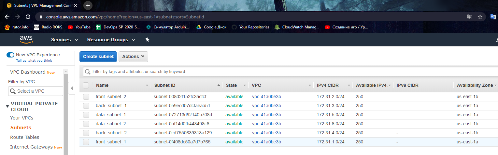
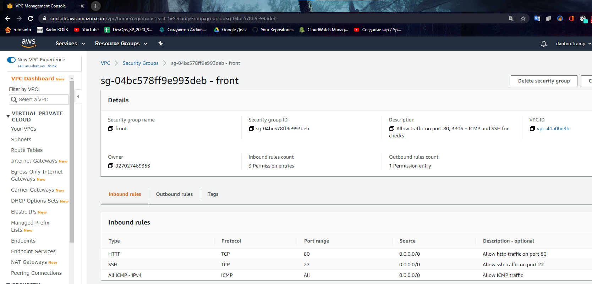
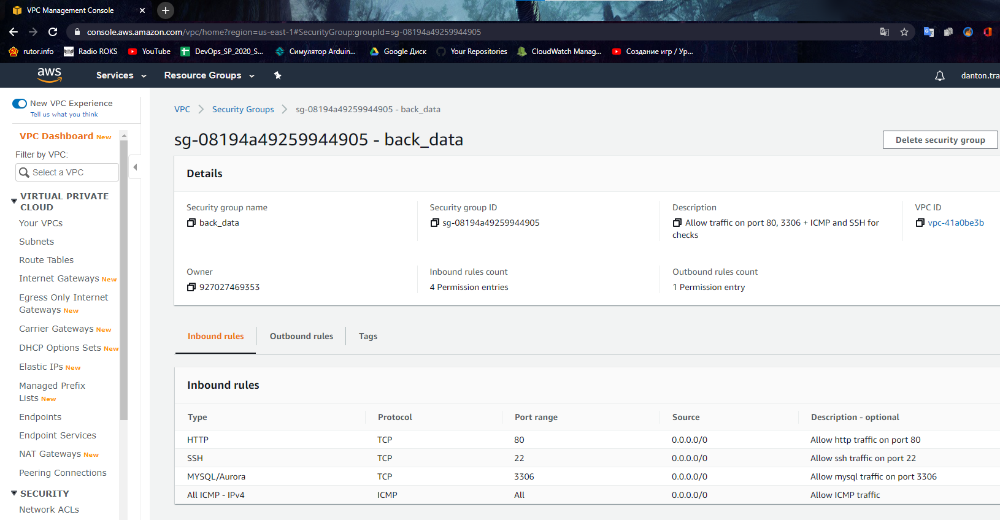
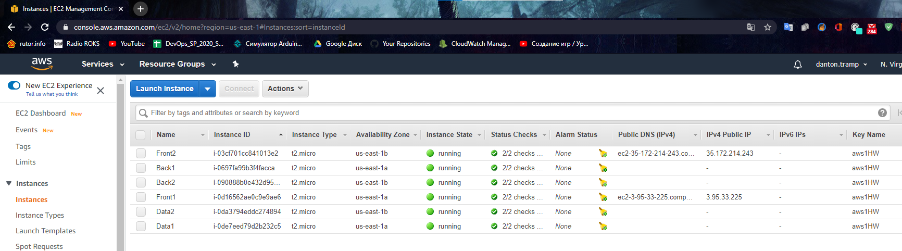
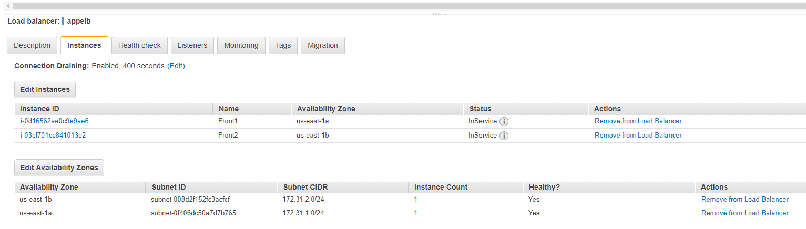
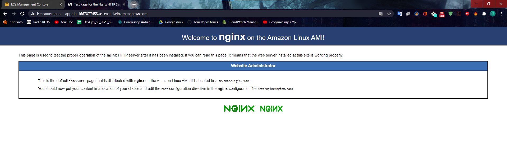
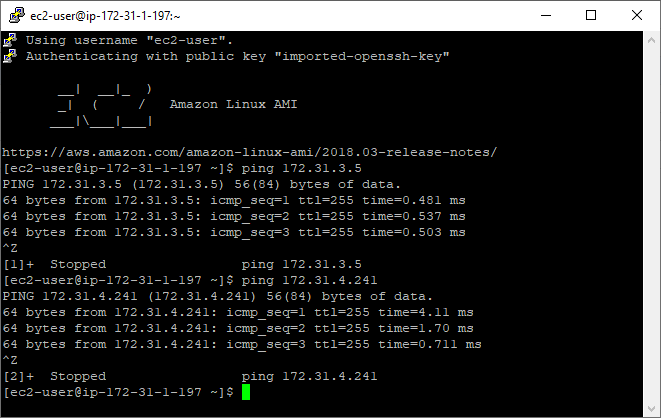
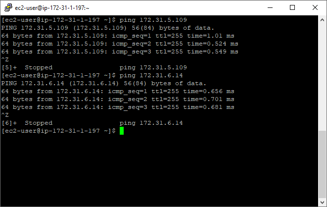
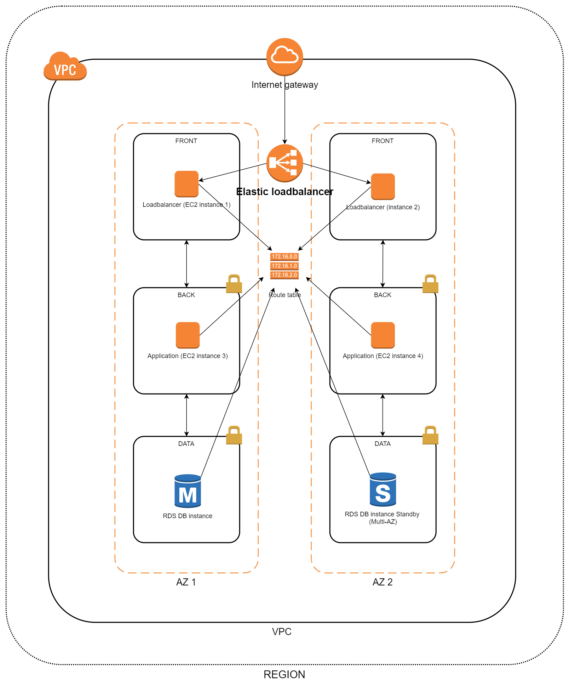

# AWS-Homework
## Table of contents
* Structure of the project
* Screenshots of the infrostructure
* Schema of the infrostructure
### Structure of the project
There are 3 folders: subnets, instances and loadbalancer. They are one terraform project, but devided into 3 parts (that's because some parametrs code gets useing "data" module and in some cases those parametrs don't exist at the stat of building infrastructure, for example - subnet IDs don't exist before terraform build them, so "data" gathering can fail all code if files from "instances" and "subnets" folders will be in one folder together).
* "Subnets" purpose: creation of the6 subnets (2 public and 4 privat) and 2 security groups for this subnets (1 for privat subnets and 1 for public ones).
* "Instances" purpose: creation of the 6 test instances.
* "Loadbalancer" purpose: creation of the loadbalancer between 2 instances in 2 public subnets in 2 AZ.
### Screenshots of the infrostructure

**Subnets:**

**Public security group:**

**Privat security group:**

**Instances:**

**Loadbalancer:**

**Nginx gefault webpage on loadbalance's DNS

**Pinging application instances from public:**

**Pinging database instances from public:**

### Schema of the infrostructure

